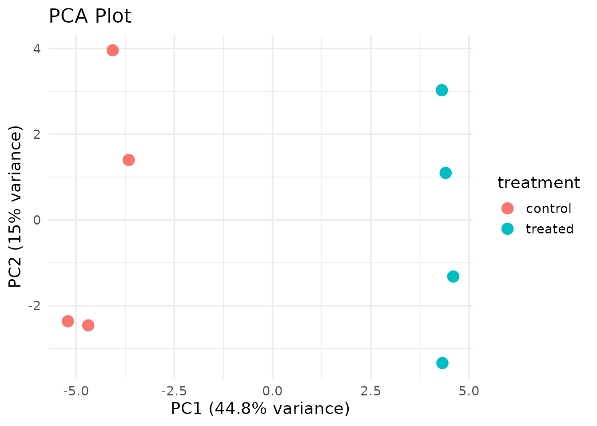
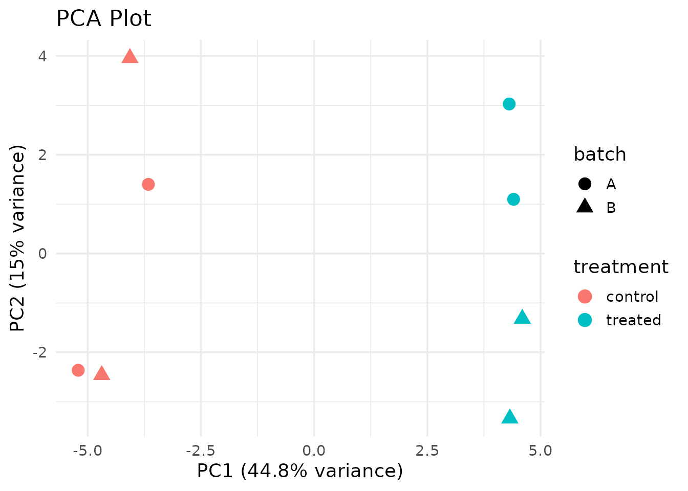

# Getting Started with ADS 8192

## Overview

**ADS 8192: Developing Scientific Applications** teaches the “three
interfaces, one core” architecture for scientific software in R. This
package provides the reference implementation: a set of PCA analysis
functions for SummarizedExperiment objects, a Shiny interactive
explorer, and a command-line interface.

## Installation

``` r
# Install Bioconductor dependencies first
if (!require("BiocManager", quietly = TRUE))
    install.packages("BiocManager")
BiocManager::install(c("SummarizedExperiment", "airway"))

# Install the course package
remotes::install_github("YOUR-USERNAME/ADS8192")
```

## Quick Start

``` r
library(ADS8192)

# Load the example dataset (100 genes, 8 samples)
data(example_se)
example_se
#> class: SummarizedExperiment 
#> dim: 100 8 
#> metadata(0):
#> assays(1): counts
#> rownames(100): gene1 gene2 ... gene99 gene100
#> rowData names(2): gene_id gene_symbol
#> colnames(8): sample1 sample2 ... sample7 sample8
#> colData names(3): sample_id treatment batch
```

### Run PCA

``` r
result <- run_pca(example_se, n_top = 50)

# View the PCA scores merged with sample metadata
head(result$scores)
#>   sample_id       PC1       PC2        PC3        PC4        PC5        PC6
#> 1   sample1 -3.661089  1.400546  1.1513110 -2.9495180 -2.9900017  0.8073388
#> 2   sample2 -4.690739 -2.460840 -2.0430942  3.2092803 -0.9257690  1.9138380
#> 3   sample3 -5.210003 -2.364561  0.1337717 -0.8679711  0.5684443 -3.1293259
#> 4   sample4 -4.068511  3.959228  1.0888244  0.3559802  3.1898969  0.7659579
#> 5   sample5  4.404284  1.097518 -3.2408775 -1.8398335  0.2241627  1.0180449
#> 6   sample6  4.321797 -3.339700 -1.0686472 -1.3597673  1.6525663  0.1609117
#>          PC7          PC8 treatment batch
#> 1  1.0179046 6.865967e-15   control     A
#> 2 -0.1096081 7.192660e-15   control     B
#> 3 -1.1712973 7.213094e-15   control     A
#> 4  0.4207278 6.214588e-15   control     B
#> 5 -2.2998585 6.303431e-15   treated     A
#> 6  2.3134294 6.697588e-15   treated     B
```

### Visualize

``` r
plot_pca(result, color_by = "treatment")
```



``` r
plot_pca(result, color_by = "treatment", shape_by = "batch")
```



### Check Variance Explained

``` r
pca_variance_explained(result)
#>    PC variance_percent
#> 1 PC1     4.481833e+01
#> 2 PC2     1.501521e+01
#> 3 PC3     1.346550e+01
#> 4 PC4     9.167293e+00
#> 5 PC5     7.225522e+00
#> 6 PC6     5.971530e+00
#> 7 PC7     4.336612e+00
#> 8 PC8     1.049730e-28
```

## The “Three Interfaces, One Core” Architecture

                    Package Core
      make_se() → run_pca() → plot_pca()
            ↑            ↑            ↑
       ┌────┴────┐  ┌────┴────┐  ┌───┴─────┐
       │ R API   │  │ Shiny   │  │  CLI    │
       │ (users) │  │ (web)   │  │(scripts)│
       └─────────┘  └─────────┘  └─────────┘

All three interfaces call the **same core functions**. Fix a bug once,
and it’s fixed everywhere.

### Interface 1: R API

``` r
library(ADS8192)
result <- run_pca(se, n_top = 500)
plot_pca(result, color_by = "treatment")
```

### Interface 2: Shiny App

``` r
ADS8192::run_app()
```

### Interface 3: CLI (via Rapp)

``` bash
ADS8192 pca --counts counts.tsv --meta samples.tsv --output results/
```

## Course Lectures

The package includes all lecture materials as pkgdown articles. See the
“Course Materials” dropdown in the navigation bar.
