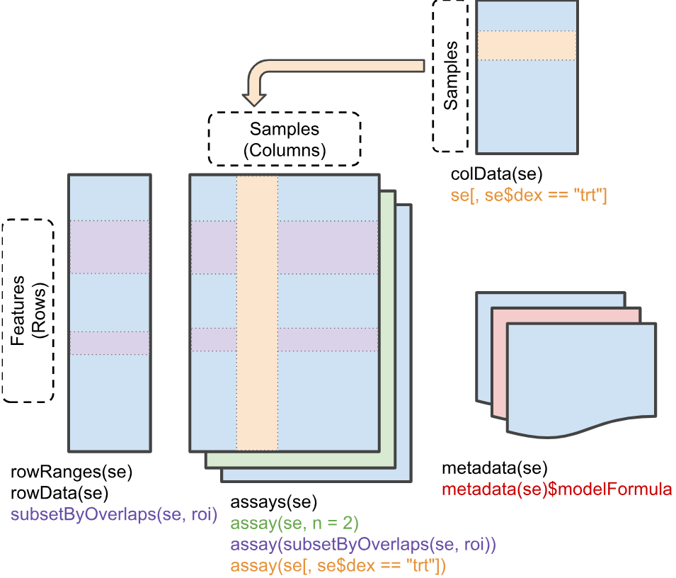

```{r setup, include=FALSE}
knitr::opts_chunk$set(
  echo = TRUE,
  eval = FALSE,
  message = FALSE,
  warning = FALSE,
  fig.width = 8,
  fig.height = 6
)
```

# Motivation

The first half of "data science" is data. This key facet is often overlooked and underappreciated, but how data is managed and structured is a critical aspect of robust analysis and maintainable scientific software. It can enable or constrain how quickly and easily you can perform analyses, build tools, and collaborate with others.

If your data structures are reliable and your code accepts and returns well-defined objects, you can test them more easily, hand them to collaborators with less explanation, and reuse the same code across experiments and analyses more effectively.

Thus, we start our learning journey at it's proper place - at the beginning, down in the unstructured primordial muck with the data itself. 

## Learning Objectives

By the end of this lecture, you will be able to:

1. Determine when to build your own data structure vs reuse an existing one
2. Create a custom S4 class in R with slots, validity checks, and methods
3. Describe the difference between CRAN and Bioconductor
4. Name and interact with the core components of a `SummarizedExperiment` object
5. Convert raw analysis code into modular functions

---

# Group Discussion + Pseudocode: Designing a Gene Data Structure

**Prompt:** "How would you create a data structure to represent a gene?"

Discuss in groups and sketch a simple structure. Think about:

- Which fields are **core** (required) vs **derived** (can be computed)?
- Which fields are **optional** vs **always present**?
- How will you ensure **validity** (e.g., start <= end, strand in {+,-})?

## Simple Pseudocode (List-Based)

For instance, if we just used a list with elements for fields we care about, it might look like:

<details>
<summary>Example list-based structure</summary>

```r
gene <- list(
    gene_id = "ENSG00000141510",
    symbol = "TP53",
    chr = "17",
    start = 7661779,
    end = 7687550,
    strand = "-",
    biotype = "protein_coding",
    length = 7687550 - 7661779 + 1  # derived
)
```

</details>


What are the most immediate issues of such a simple approach?

---

# Object Oriented Programming in R

R has several systems for defining custom classes and methods, each with their own advantages and tradeoffs:

- **[S3](https://adv-r.hadley.nz/s3.html)**: Informal, flexible, and widely used. Classes are just character vectors, and method dispatch is based on naming conventions (e.g., `print.myclass()`). No formal class definitions or validity checks.
- **[S4](https://adv-r.hadley.nz/s4.html)**: Formal class definitions with typed slots, validity checks, and formal method dispatch. More robust but more verbose and complex to set up.
- **[R6](https://adv-r.hadley.nz/r6.html)**: Reference classes with mutable state and object-oriented programming features. Less common in bioinformatics but useful for certain applications.

You can read more about these individual systems and [their tradeoffs](https://adv-r.hadley.nz/oo-tradeoffs.html) in the Advanced R book, but we will focus mostly on S4 for reasons described below.

# Why S4 in Bioconductor?

Bioconductor packages rely heavily on R's **S4 classes** because they provide:

- **Formal class definitions** (clear structure and types)
- **Validity checks** (catch invalid objects early)
- **Method dispatch** (functions behave differently based on object class)

These are very attractive features for building complex data structures that need to be robust and interoperable across a large ecosystem of packages. S3 is much more flexible and simpler, but it lacks the formal structure and safety guarantees that S4 provides. 

S3 provides limited mechanisms to keep users from doing really stupid things with your objects, which is important when your objects are complex and serve as the basis for many downstream analyses.

S4 also requires more upfront thought and design, which should generally be encouraged for scientific software.

## S4-Style Sketch (Class + Constructor)

Building a custom S4 class for our gene above might look like this.

The first step is registering the class and its **slots** — the typed fields
every instance must carry:

```{r gene-setclass, eval=FALSE}
# setClass() registers the class with R's S4 system.
# `slots` is a named character vector: name -> type.
# R enforces these types at construction time: passing a non-character to
# `gene_id` will throw an error immediately, not silently coerce it.
setClass("Gene",
         slots = c(
             gene_id = "character",
             symbol  = "character",
             chr     = "character",
             start   = "integer",
             end     = "integer",
             strand  = "character",
             biotype = "character"
         ))
```

`new("Gene", ...)` would work directly, but we wrap it in a **constructor
function** so callers don't need to know the internal class name — and so we
have one place to coerce types, run checks, and set defaults:

```{r gene-constructor, eval=FALSE}
# The constructor is just a regular function. It:
#   1. Accepts user-friendly types (numeric start/end is fine)
#   2. Coerces them to the slot types the class expects
#   3. Delegates to new() with slot values already validated
#
# Users should never call new("Gene", ...) directly — always use Gene().
Gene <- function(gene_id, symbol, chr, start, end, strand, biotype) {
    new("Gene",
        gene_id = gene_id,
        symbol  = symbol,
        chr     = chr,
        start   = as.integer(start),   # coerce numeric → integer
        end     = as.integer(end),
        strand  = strand,
        biotype = biotype
    )
}
```

---

## Step 2: Adding a Validity Method

A class with no validity check will happily hold nonsense — a gene where
`start > end`, or a `strand` character that is neither `"+"` nor `"-"`.

> **What is an invariant?** 
> 
> An invariant is a condition that must *always* be
> true for an object to be considered valid — regardless of how it was created
> or modified. For a genomic coordinate object, `start <= end` is an invariant:
> there is no meaningful gene where the end comes before the start. `strand %in%
> c("+", "-", "*")` is another — the strand field only makes sense for a fixed
> vocabulary of values. Invariants are distinct from *defaults* (which are
> suggestions) and *types* (which R enforces slot-by-slot) — they encode domain
> knowledge that the type system alone cannot express.

`setValidity()` lets you encode these invariants as a function that is checked
every time `validObject()` is called (and optionally on every `new()`):

```{r gene-validity, eval=FALSE}
setValidity("Gene", function(object) {
    errors <- character()

    # Invariant 1: strand must be one of the accepted values
    if (!object@strand %in% c("+", "-", "*")) {
        errors <- c(errors,
            paste0("strand must be '+', '-', or '*', got: '",
                   object@strand, "'"))
    }

    # Invariant 2: genomic coordinates must be positive
    if (object@start < 1L) {
        errors <- c(errors,
            paste0("start must be >= 1, got: ", object@start))
    }

    # Invariant 3: start must not exceed end
    if (object@start > object@end) {
        errors <- c(errors,
            paste0("start (", object@start, ") must be <= end (", object@end, ")"))
    }

    # Return TRUE when valid, or the error messages when invalid.
    # The S4 system will stop() with these messages automatically.
    if (length(errors) == 0) TRUE else errors
})
```

> **Key design point:** validity checks live in `setValidity()`, *not* in the
> constructor. That way they fire whenever the object could be in an invalid
> state — including after programmatic slot replacement — not just at
> construction time.

---

## Step 3: Generic Getters and Setters

Direct slot access with `@` works but leaks implementation details: if you
ever rename a slot, every caller breaks. **[Generic functions](https://adv-r.hadley.nz/s4.html#s4-generics)** give you a
stable API that can evolve independently of the internal representation:

```{r gene-accessors, eval=FALSE}
# --- Getters ---
# setGeneric() creates a new generic if one doesn't already exist.
# The second argument is the default method body (usually just callNextMethod()
# or a forwarding call). Real dispatch happens in setMethod().

setGeneric("geneId",  function(object) standardGeneric("geneId"))
setGeneric("symbol",  function(object) standardGeneric("symbol"))
setGeneric("seqname", function(object) standardGeneric("seqname"))
setGeneric("gstart",  function(object) standardGeneric("gstart"))
setGeneric("gend",    function(object) standardGeneric("gend"))
setGeneric("strand",  function(object) standardGeneric("strand"))
setGeneric("biotype", function(object) standardGeneric("biotype"))

# setMethod() wires each generic to our Gene class.
# `object@slot_name` is how you read a slot *inside* the package;
# outsiders should use the getter, never @.
setMethod("geneId",  "Gene", function(object) object@gene_id)
setMethod("symbol",  "Gene", function(object) object@symbol)
setMethod("seqname", "Gene", function(object) object@chr)
setMethod("gstart",  "Gene", function(object) object@start)
setMethod("gend",    "Gene", function(object) object@end)
setMethod("strand",  "Gene", function(object) object@strand)
setMethod("biotype", "Gene", function(object) object@biotype)

# --- Setters ---
# The replacement generic follows the R convention: foo<-()
# `validObject()` re-runs setValidity() so invariants are enforced
# even after modification — you can't accidentally set start > end.

setGeneric("gstart<-", function(object, value) standardGeneric("gstart<-"))
setGeneric("gend<-",   function(object, value) standardGeneric("gend<-"))
setGeneric("strand<-", function(object, value) standardGeneric("strand<-"))
setGeneric("biotype<-", function(object, value) standardGeneric("biotype<-"))
setGeneric("symbol<-", function(object, value) standardGeneric("symbol<-"))
setGeneric("geneId<-", function(object, value) standardGeneric("geneId<-"))
setGeneric("seqname<-", function(object, value) standardGeneric("seqname<-"))

setReplaceMethod("gstart", "Gene", function(object, value) {
    object@start <- as.integer(value)
    validObject(object)
    object
})

setReplaceMethod("gend", "Gene", function(object, value) {
    object@end <- as.integer(value)
    validObject(object)
    object
})

# strand<- re-runs validObject() so the strand invariant is enforced
setReplaceMethod("strand", "Gene", function(object, value) {
    object@strand <- as.character(value)
    validObject(object)
    object
})

# biotype<-, symbol<-, geneId<-, seqname<- are simple character setters;
# no cross-slot invariants, so validObject() is still called for
# type-safety and future-proofing.
setReplaceMethod("biotype", "Gene", function(object, value) {
    object@biotype <- as.character(value)
    validObject(object)
    object
})

setReplaceMethod("symbol", "Gene", function(object, value) {
    object@symbol <- as.character(value)
    validObject(object)
    object
})

setReplaceMethod("geneId", "Gene", function(object, value) {
    object@gene_id <- as.character(value)
    validObject(object)
    object
})

setReplaceMethod("seqname", "Gene", function(object, value) {
    object@chr <- as.character(value)
    validObject(object)
    object
})
```

---

## Step 4: A `show()` Method

By default, printing an S4 object dumps every slot in a hard-to-read format.
Overriding `show()` gives users a clean summary — and it's the method called
automatically when you type the object name at the prompt:

```{r gene-show, eval=FALSE}
setMethod("show", "Gene", function(object) {
    cat("Gene:", object@symbol, "(", object@gene_id, ")\n")
    cat("  Location:", paste0("chr", object@chr, ":",
                              object@start, "-", object@end,
                              " (", object@strand, ")"), "\n")
    cat("  Biotype:", object@biotype, "\n")
    # Compute length on the fly — no need to store it as a slot
    cat("  Length:", object@end - object@start + 1L, "bp\n")
})
```

---

## Step 5: A Computed Method (`length`)

Some properties are fully determined by existing slots — storing them would
create redundancy and a risk of inconsistency. Instead, define them as
methods that compute on demand:

```{r gene-length-method, eval=FALSE}
# R already has a length() generic; we just add a method for our class.
setMethod("length", "Gene", function(object) {
    object@end - object@start + 1L
})
```

---

## Full Usage Example

Putting it all together:

```{r gene-full-example, eval=FALSE}
# Construction — types are coerced automatically
tp53 <- Gene(
    gene_id = "ENSG00000141510",
    symbol  = "TP53",
    chr     = "17",
    start   = 7661779,
    end     = 7687550,
    strand  = "-",
    biotype = "protein_coding"
)

# show() fires automatically — clean, readable output
tp53

# Getters — stable API, independent of slot names
geneId(tp53)      # "ENSG00000141510"
symbol(tp53)      # "TP53"
seqname(tp53)     # "17"
gstart(tp53)      # 7661779L
length(tp53)      # 25772L  (computed, not stored)

# Setter — validity is re-checked automatically
gend(tp53) <- 7688000
length(tp53)      # 26222L — updated correctly

# Validity catches nonsense immediately
tryCatch(
    Gene("X", "BAD", "1", start = 500, end = 100, strand = "?",
         biotype = "protein_coding"),
    error = function(e) message("Caught: ", conditionMessage(e))
)
# Caught: strand must be '+', '-', or '*', got: '?'
# (start > end would also be caught in the same call)
```

## S4 Best Practices (Design Checklist)

- Keep **slots minimal** and focused on essential fields
- Write **validity checks** for invariants (e.g., `start <= end`) via `setValidity()`
- Provide **constructor functions** so users never call `new()` directly
- Provide **generic getters/setters** via `setGeneric()` / `setMethod()` instead of direct slot access (`@`)
- Call **`validObject()`** inside setters to re-enforce invariants after modification
- Override **`show()`** for a readable console representation
- Implement derived properties as **methods**, not stored slots
- Document **invariants** and expected slot types with roxygen2

---

# On Wheel Reinvention

Based on that small example, you can see how much work goes into building a robust data structure. 
Carelessly slapping together a data structure can lead to serious headaches downstream that result in constant reimplementations and refactors that can break backwards compatibility (looking at you, `Seurat`).

Before embarking on such an endeavor, it is in your best interest to determine if there are adequate already existing data structures for your data modality and what you want to achieve.

In this case, Bioconductor already has battle-tested data structures for many common assay types and 'omics-related elements — including representations of genomic features (`GenomicFeatures`, `GenomicRanges`) and general count data (`SummarizedExperiment` and domain-specific extensions like `SingleCellExperiment`, `SpatialExperiment`). These classes have been tested, documented, and widely adopted by the community. They also interoperate with hundreds of downstream packages that expect these containers.

## The "Do I Really Need to Roll My Own?" Checklist

Before you adopt or build a data structure, consider:

- **Problem fit**: Does an existing class match the sort of data you have?
- **Data model fit**: Can it represent the different facets of the data (counts, sample metadata, feature metadata) without hacks?
- **Contract clarity**: Are the accessors and invariants clear from the docs?
- **Interoperability**: Do downstream packages already expect this container?
- **Maintenance**: Is the package well documented and actively used?

Knowing how to design and build your own data structures is important, but knowing when to reuse existing ones is just as crucial.
Don't reinvent the wheel if a well-designed, community-supported solution already exists.


If you *do* decide to build your own structure, design carefully, choose an appropriate base class (S4 is not the only option), and ensure your implementation is robust and well-documented.

---

# Scientific Software Ecosystems

More often than not, you will be building on existing software ecosystems rather than starting from scratch. This is especially true in bioinformatics, where the complexity of the data and analyses often necessitates building on top of established tools and data structures.

## CRAN - The Comprehensive R Archive Network

CRAN is the primary repository for general R packages. It has strict submission guidelines to ensure quality and stability, but it is not domain-specific. CRAN packages can be used in any context, but they may not have the specialized data structures or methods needed for bioinformatics. That said, many CRAN packages are widely used in bioinformatics workflows (e.g., `ggplot2`, `dplyr`, `purrr`), and Bioconductor packages often depend on CRAN packages for core functionality. 

Any time you install a package with `install.packages()`, you're pulling from CRAN.

## Bioconductor - Open Source Software for Bioinformatics

[Bioconductor](https://www.bioconductor.org/) is a more specialized repository focused on repeatable analysis of biological data.

It includes core packages that define data structures and methods for common bioinformatics data types (e.g., `SummarizedExperiment`, `SingleCellExperiment`, `GenomicRanges`), as well as hundreds of downstream packages that build on these foundations to provide tools for specific analyses (e.g., differential expression, clustering, gene set analysis).

Bioconductor has their [own set of submission guidelines](https://bioconductor.org/developers/package-submission/) that emphasize interoperability, documentation, and testing. Submission review is an interactive process performed on Github.

As you dive deeper into bioinformatics and computational biology, you'll find yourself becoming very familiar with Bioconductor's core data structures and methods, and you'll likely be building your own tools that operate on these objects. Understanding the design and structure of these classes will help you write more robust and interoperable R code.


---

# An Illustrative Example: SummarizedExperiment

Let's take a look at a very common S4 class offered by Bioconductor - [SummarizedExperiment](https://bioconductor.org/packages/devel/bioc/vignettes/SummarizedExperiment/inst/doc/SummarizedExperiment.html).

We'll use the `airway` dataset, which contains RNA-seq data from airway smooth muscle cells. 

```{r load-airway}
library(SummarizedExperiment)
library(airway)
library(ComplexHeatmap)
library(ggplot2)

data("airway")
```

## Exploring the Structure

### What class is this object?

```{r class}
airway
```

`RangedSummarizedExperiment` is an extension of `SummarizedExperiment` that also stores genomic ranges for each feature (gene).

### The `SummarizedExperiment` Structure

Though it may at first seem complicated, the `SummarizedExperiment` structure is elegantly intuitive once you understand the core components. It consists of three main parts - `rowData`, `colData`, and `assays` - that are designed to keep related information synchronized and organized.



### Sample Metadata (colData)

The `colData()` function extracts sample-level metadata:

```{r coldata}
colData(airway)
```

Key variables:
- `cell`: Cell line identifier
- `dex`: Treatment status - "trt" (dexamethasone) or "untrt" (control)

```{r coldata-access}
# Access as a data.frame
as.data.frame(colData(airway))

# Access specific columns
airway$dex
airway$cell

# Adding a new column is simple
airway$group <- paste(airway$cell, airway$dex, sep = "_")
# Equivalent to: colData(airway)$group <- paste(colData(airway)$cell, colData(airway)$dex, sep = "_")
```

### Feature Metadata (rowData)

The `rowData()` function extracts feature-level (gene) metadata:
                       
```{r rowdata}
rowData(airway)

# To add columns to rowData, it must be accessed directly rather than using `$` on
# the SummarizedExperiment object itself.
rowData(airway)$type <- ifelse(rowData(airway)$gene_id %in% c("ENSG00000141510", "ENSG00000171862"),
                                "important_gene", "other")

# Check the new column
table(rowData(airway)$type)
```

### Assay Data (the actual values)

The actual expression data is stored in "assays". This dataset has one assay called "counts":

```{r assays}
# What assays are available?
assayNames(airway)

# Get the counts matrix
counts_matrix <- assay(airway, "counts")
# Or equivalently: assays(airway)$counts

# Check dimensions
dim(counts_matrix)

# Preview first few genes and samples
counts_matrix[1:5, 1:4]
```

Note that a `SummarizedExperiment` can hold multiple assays (e.g., raw counts, normalized counts, log-transformed values) in the same object, each accessible by name.

`SingleCellExperiment` can even hold different experiments via `altExps()`, and other varieties offer other features, like spatial coordinates in `SpatialExperiment`. But all of these data structures share the baseline functionality and structure of `SummarizedExperiment`.

### Basic Operations

Generally, you can interact with a `SummarizedExperiment` object as you would with a typical matrix or data.frame, but it also has specialized accessors for its components. 

```{r operations}
# Subsetting works like a matrix, but keeps everything in sync
airway_subset <- airway[1:100, 1:4]  # first 100 genes, first 4 samples

# Can see that rowData and colData are intact and subsetted accordingly
rowData(airway_subset)
colData(airway_subset)
```

### Creating a `SummarizedExperiment` from Components

Actually creating a `SummarizedExperiment` is simple, you just need to provide the assay matrix, sample metadata, and optionally feature metadata. The constructor will check that everything is properly aligned (matching row and column names) and will throw an error if not.

```{r create-se-simple}
# Tiny example: 3 genes x 3 samples
counts_mat <- matrix(
    c(100, 200, 150,
       50,  80,  60,
      400, 350, 420),
    nrow = 3, ncol = 3,
    dimnames = list(
        c("GeneA", "GeneB", "GeneC"),
        c("S1", "S2", "S3")
    )
)

sample_meta <- data.frame(
    treatment = factor(c("ctrl", "trt", "trt")),
    row.names = c("S1", "S2", "S3")
)

# rowData is optional — omit it and SE still works fine
gene_meta <- data.frame(
    biotype = c("protein_coding", "lncRNA", "protein_coding"),
    row.names = c("GeneA", "GeneB", "GeneC")
)

se <- SummarizedExperiment(
    assays  = list(counts = counts_mat),
    colData = sample_meta,
    rowData = gene_meta   # optional
)

se
```

---
 
# Building Functions

Now we'll switch tack. If you haven't already, take 5-10 minutes to choose a project from the [Project Selection Guide](https://st-jude-ms-abds.github.io/ADS8192/articles/project-selection.html).
Remember you cannot choose the same project as a classmate, so first come first served.

For the rest of this unit, you'll be building an R package around that project. 

You'll note that each project has a "raw code" version of the analysis, which is a single R script that performs the entire analysis from start to finish. This is a common way to start an analysis — you just write code that gets the job done, without worrying much about structure or reusability.

Once the code/analysis is deemed useful, you might go back and refactor it into a more modular, reusable form for future use or sharing with others. 

## Getting the Data

First, you'll need data to operate on. All of the projects in the project guide have code to pull real data for use. Some of them may subset the data to make it easier to handle for development and testing purposes.

There are all sorts of avenues to get data for testing and development — from public repositories like GEO (Gene Expression Omnibus, which contains much more than just gene expression data), to simulated data, to data you've generated yourself. 

For my package, I'll use the airway dataset we used above. 

## Planning Functions

Before the begin coding, it's worth spending a few minutes to plan out the functions you'll want to build. 

- What are the key steps in your analysis?
- Which parts of the code are most reusable?
- Which parameters should be adjustable for greatest flexibility?

Take ~10 minutes to sketch out a plan for the functions you think you need. It's often helpful to write out the pseudocode for each function — what inputs it will take, what outputs it will produce, and the key steps it will perform.

Generally, you want a function to do one or two things cleanly. Sometimes, some complexity is necessary, but striving for simplicity is usually a good thing. If you find yourself writing a function with 200+ lines or dozens of parameters, it's probably a sign that you should break it up into smaller pieces. 

These projects should be in the ~4-10 function range. 

This doesn't have to be perfect, it can and probably will change as you start implementing. Having a rough plan tends to help you stay focused and makes it easier to actually start breaking up what can be a daunting analyis (particularly if you didn't write it yourself).

In my case, I think I'll need functions for the following:
1. `top_variable_features()`: Select the most variable genes for PCA
2. `run_pca()`: Perform PCA on the data
3. `pca_variance_explained()`: Helper function to calculate variance explained by PCs
4. `plot_pca()`: Create a PCA scatter plot colored by sample metadata
5. `plot_variance_explained()`: Create a bar chart of variance explained per PC
6. `save_pca_results()`: Save PCA results to disk

---

Let's walk through the raw analysis code from the
[Project 0 reference](project-selection.html) step by step, then refactor each
piece into a reusable function. The raw script lives in the project description
— here we'll pull out each section and show how it becomes a package function.

## Step 1: Feature Selection

The raw script selects the 500 most variable genes by row variance:

```{r raw-feature-selection, eval=FALSE}
# --- Feature selection: top 500 most variable genes ---
mat <- assay(airway, "counts")
vars <- apply(mat, 1, stats::var)
top_idx <- order(vars, decreasing = TRUE)[seq_len(500)]
se_top <- airway[top_idx, ]
```

This is a natural boundary for a function — it takes a
`SummarizedExperiment` and returns a subsetted one. We can also make the
number of genes (`n`) and the assay name configurable:

<details>
<summary><b>Refactored function: <code>top_variable_features()</code></b></summary>

```{r top-variable}
#' Select top variable features
#'
#' @param se A SummarizedExperiment object
#' @param n Number of top variable features to select (default: 500)
#' @param assay_name Name of assay to use (default: "counts")
#'
#' @return A SummarizedExperiment subset to the top n variable features
top_variable_features <- function(se, n = 500, assay_name = "counts") {
    mat <- assay(se, assay_name)
    vars <- apply(mat, 1, stats::var)
    top_idx <- order(vars, decreasing = TRUE)[seq_len(min(n, length(vars)))]
    se[top_idx, ]
}
```

</details>

```{r test-top-var}
# Get top 500 variable genes
se_top <- top_variable_features(airway, n = 500)
dim(se_top)
```

---

## Step 2: PCA

The raw script runs PCA on the filtered data, log-transforms, transposes,
then merges the PC scores back with sample metadata:

```{r raw-pca, eval=FALSE}
# --- PCA ---
mat <- assay(se_top, "counts")
mat <- log2(mat + 1)                 # log-transform with pseudocount
mat_t <- t(mat)                      # prcomp expects samples as rows
pca_result <- prcomp(mat_t, scale. = TRUE, center = TRUE)

# Build scores data.frame merged with sample metadata
scores <- as.data.frame(pca_result$x)
scores$sample_id <- rownames(scores)
col_data <- as.data.frame(colData(airway))
col_data$sample_id <- rownames(col_data)
scores <- merge(scores, col_data, by = "sample_id")
scores <- scores[order(scores$sample_id), ]
rownames(scores) <- NULL
```

This is the most complex step. The function wraps feature selection *and* PCA
together, since they're always run in sequence. We expose `log_transform` and
`scale` as parameters so the user can control the preprocessing:

<details>
<summary><b>Refactored function: <code>run_pca()</code></b></summary>

```{r run-pca}
#' Run PCA on a SummarizedExperiment
#'
#' @param se A SummarizedExperiment object
#' @param assay_name Name of assay to use (default: "counts")
#' @param n_top Number of top variable features to use (default: 500)
#' @param scale Logical; should features be scaled? (default: TRUE)
#' @param log_transform Logical; should counts be log-transformed? (default: TRUE)
#'
#' @return A list with:
#'   - pca: The prcomp object
#'   - scores: A data.frame of PC scores merged with sample metadata
run_pca <- function(se, assay_name = "counts", n_top = 500,
                    scale = TRUE, log_transform = TRUE) {
    # Subset to top variable features
    se_top <- top_variable_features(se, n = n_top, assay_name = assay_name)

    # Get the data matrix
    mat <- assay(se_top, assay_name)

    # Log-transform if requested (add pseudocount to avoid log(0))
    if (log_transform) {
        mat <- log2(mat + 1)
    }

    # Transpose: prcomp expects samples as rows
    mat_t <- t(mat)

    # Run PCA
    pca_result <- prcomp(mat_t, scale. = scale, center = TRUE)

    # Create scores data.frame with sample metadata
    scores <- as.data.frame(pca_result$x)
    scores$sample_id <- rownames(scores)

    # Merge with colData, preserving sample order
    col_data <- as.data.frame(colData(se))
    col_data$sample_id <- rownames(col_data)
    scores <- merge(scores, col_data, by = "sample_id")

    # Sort by sample_id for deterministic output
    scores <- scores[order(scores$sample_id), ]
    rownames(scores) <- NULL

    list(
        pca = pca_result,
        scores = scores
    )
}
```

</details>

```{r test-pca}
# Run PCA on airway data
pca_result <- run_pca(airway, n_top = 500)

# Examine the scores
head(pca_result$scores)

# Check variance explained
summary(pca_result$pca)
```

---

## Step 3: Variance Explained

The raw script computes the percentage of variance captured by each PC:

```{r raw-variance, eval=FALSE}
# --- Variance explained ---
var_explained <- pca_result$sdev^2 / sum(pca_result$sdev^2) * 100
var_df <- data.frame(
    PC = paste0("PC", seq_along(var_explained)),
    variance_percent = var_explained
)
```

This is a small helper — it extracts the variance info from a `prcomp`
object into a tidy data.frame. We wrap it in a function that takes the
output of `run_pca()`:

<details>
<summary><b>Refactored function: <code>pca_variance_explained()</code></b></summary>

```{r pca-variance}
#' Get variance explained by each PC
#'
#' @param pca_result Output from run_pca()
#'
#' @return A data.frame with PC names and percent variance explained
pca_variance_explained <- function(pca_result) {
    pca <- pca_result$pca
    var_explained <- pca$sdev^2 / sum(pca$sdev^2) * 100

    data.frame(
        PC = paste0("PC", seq_along(var_explained)),
        variance_percent = var_explained
    )
}
```

</details>

```{r test-variance}
var_df <- pca_variance_explained(pca_result)
head(var_df)
```

---

## Step 4: Visualization

The raw script produces two plots — a PCA scatter and a variance bar chart:

```{r raw-plots, eval=FALSE}
# --- PCA scatter plot ---
var_x <- round(var_df$variance_percent[1], 1)
var_y <- round(var_df$variance_percent[2], 1)

p_pca <- ggplot(scores, aes(x = .data[["PC1"]], y = .data[["PC2"]])) +
    geom_point(aes(color = .data[["dex"]]), size = 4) +
    theme_bw(base_size = 14) +
    labs(x = paste0("PC1 (", var_x, "% variance)"),
         y = paste0("PC2 (", var_y, "% variance)"),
         title = "PCA Plot")
print(p_pca)

# --- Variance explained bar chart ---
var_top <- var_df[1:8, ]
var_top$PC <- factor(var_top$PC, levels = var_top$PC)

p_var <- ggplot(var_top, aes(x = .data$PC, y = .data$variance_percent)) +
    geom_col(fill = "steelblue") +
    geom_text(aes(label = sprintf("%.1f%%", .data$variance_percent)),
              vjust = -0.5, size = 4) +
    theme_bw(base_size = 14) +
    labs(x = "Principal Component", y = "Variance Explained (%)") +
    ylim(0, max(var_top$variance_percent) * 1.15)
print(p_var)
```

These naturally become two functions. `plot_pca()` generalizes the scatter
plot to support arbitrary PC axes, color, and shape mappings.
`plot_variance_explained()` wraps the bar chart:

<details>
<summary><b>Refactored function: <code>plot_pca()</code></b></summary>

```{r plot-pca}
#' Create a PCA scatter plot
#'
#' @param pca_result Output from run_pca()
#' @param color_by Column name from colData to color points by
#' @param shape_by Optional column name to map to point shape
#' @param pcs Which PCs to plot (default: c(1, 2))
#' @param point_size Size of points (default: 4)
#'
#' @return A ggplot object
plot_pca <- function(pca_result, color_by = NULL, shape_by = NULL,
                     pcs = c(1, 2), point_size = 4) {
    scores <- pca_result$scores
    var_exp <- pca_variance_explained(pca_result)

    # Build PC column names
    pc_x <- paste0("PC", pcs[1])
    pc_y <- paste0("PC", pcs[2])

    # Validate requested PCs exist
    if (!pc_x %in% colnames(scores)) {
        stop("PC", pcs[1], " not found in scores. Only ",
             sum(grepl("^PC\\d+$", colnames(scores))), " PCs available.",
             call. = FALSE)
    }
    if (!pc_y %in% colnames(scores)) {
        stop("PC", pcs[2], " not found in scores. Only ",
             sum(grepl("^PC\\d+$", colnames(scores))), " PCs available.",
             call. = FALSE)
    }

    # Get variance percentages for axis labels
    var_x <- round(var_exp$variance_percent[pcs[1]], 1)
    var_y <- round(var_exp$variance_percent[pcs[2]], 1)

    p <- ggplot(scores, aes(x = .data[[pc_x]], y = .data[[pc_y]])) +
        theme_bw(base_size = 14) +
        labs(
            x = paste0(pc_x, " (", var_x, "% variance)"),
            y = paste0(pc_y, " (", var_y, "% variance)"),
            title = "PCA Plot"
        )

    # Add aesthetics if specified
    if (!is.null(color_by)) {
        p <- p + aes(color = .data[[color_by]])
    }

    if (!is.null(shape_by)) {
        p <- p + aes(shape = .data[[shape_by]])
    }

    p <- p + geom_point(size = point_size)

    p
}
```

</details>

<details>
<summary><b>Refactored function: <code>plot_variance_explained()</code></b></summary>

```{r plot-var-explained}
#' Plot variance explained by principal components
#'
#' @param pca_result Output from run_pca()
#' @param n_pcs Maximum number of PCs to display (default: 8)
#'
#' @return A ggplot object
plot_variance_explained <- function(pca_result, n_pcs = 8) {
    var_df <- pca_variance_explained(pca_result)
    var_df <- var_df[seq_len(min(n_pcs, nrow(var_df))), ]
    var_df$PC <- factor(var_df$PC, levels = var_df$PC)

    ggplot(var_df, aes(x = .data$PC, y = .data$variance_percent)) +
        geom_col(fill = "steelblue") +
        geom_text(
            aes(label = sprintf("%.1f%%", .data$variance_percent)),
            vjust = -0.5, size = 4
        ) +
        theme_bw(base_size = 14) +
        labs(
            x = "Principal Component",
            y = "Variance Explained (%)"
        ) +
        ylim(0, max(var_df$variance_percent) * 1.15)
}
```

</details>

```{r viz-pca}
# PCA scatter colored by treatment
plot_pca(pca_result, color_by = "dex")
```

```{r viz-pca-multi}
# Color by treatment, shape by cell line
plot_pca(pca_result, color_by = "dex", shape_by = "cell")
```

```{r viz-var-explained}
# Variance explained bar chart
plot_variance_explained(pca_result)
```

---

## Step 5: Export

The raw script writes the scores and variance tables to TSV files:

```{r raw-export, eval=FALSE}
# --- Export TSVs ---
output_dir <- file.path(tempdir(), "pca_output")
dir.create(output_dir, recursive = TRUE, showWarnings = FALSE)

write.table(scores, file.path(output_dir, "pca_scores.tsv"),
            sep = "\t", row.names = FALSE, quote = FALSE)
write.table(var_df, file.path(output_dir, "pca_variance.tsv"),
            sep = "\t", row.names = FALSE, quote = FALSE)

cat("Wrote results to:", output_dir, "\n")
list.files(output_dir)
```

The function version takes the `run_pca()` output and a directory, with an
optional `prefix` for filenames. Every project in the
[Project Selection Guide](project-selection.html) must produce TSV files from
the CLI — this export function is the bridge between the analysis core and the
command line:

<details>
<summary><b>Refactored function: <code>save_pca_results()</code></b></summary>

```{r save-results}
#' Save PCA results to files
#'
#' @param pca_result Output from run_pca()
#' @param output_dir Directory to save files (created if it doesn't exist)
#' @param prefix Prefix for filenames (default: "pca")
#'
#' @return Invisible NULL; called for side effects (writing files)
save_pca_results <- function(pca_result, output_dir, prefix = "pca") {
    if (!dir.exists(output_dir)) {
        dir.create(output_dir, recursive = TRUE)
    }

    # Save scores
    scores_file <- file.path(output_dir, paste0(prefix, "_scores.tsv"))
    write.table(
        pca_result$scores,
        scores_file,
        sep = "\t",
        row.names = FALSE,
        quote = FALSE
    )

    # Save variance explained
    var_file <- file.path(output_dir, paste0(prefix, "_variance.tsv"))
    var_df <- pca_variance_explained(pca_result)
    write.table(
        var_df,
        var_file,
        sep = "\t",
        row.names = FALSE,
        quote = FALSE
    )

    message("Saved: ", scores_file)
    message("Saved: ", var_file)

    invisible(NULL)
}
```

</details>

```{r test-save}
# Save results to a temporary directory
tmp_out <- file.path(tempdir(), "pca_output")
save_pca_results(pca_result, tmp_out)

# Check what was created
list.files(tmp_out)

# Read back and verify
scores_back <- read.table(file.path(tmp_out, "pca_scores.tsv"),
                          header = TRUE, sep = "\t")
head(scores_back)
```

---

## Verifying Equivalence

We've broken the raw script into six functions. Let's confirm they produce
the same results as the original inline code:

```{r equivalence-check}
# --- Run the original raw approach ---
mat_raw <- assay(airway, "counts")
vars_raw <- apply(mat_raw, 1, stats::var)
top_idx_raw <- order(vars_raw, decreasing = TRUE)[seq_len(500)]
se_top_raw <- airway[top_idx_raw, ]

mat_raw <- assay(se_top_raw, "counts")
mat_raw <- log2(mat_raw + 1)
pca_raw <- prcomp(t(mat_raw), scale. = TRUE, center = TRUE)

scores_raw <- as.data.frame(pca_raw$x)
scores_raw$sample_id <- rownames(scores_raw)
col_data_raw <- as.data.frame(colData(airway))
col_data_raw$sample_id <- rownames(col_data_raw)
scores_raw <- merge(scores_raw, col_data_raw, by = "sample_id")
scores_raw <- scores_raw[order(scores_raw$sample_id), ]
rownames(scores_raw) <- NULL

var_raw <- pca_raw$sdev^2 / sum(pca_raw$sdev^2) * 100
var_df_raw <- data.frame(
    PC = paste0("PC", seq_along(var_raw)),
    variance_percent = var_raw
)

# --- Run via package functions ---
result_pkg <- run_pca(airway, n_top = 500)
var_df_pkg <- pca_variance_explained(result_pkg)

# --- Compare ---
all.equal(scores_raw, result_pkg$scores)
all.equal(var_df_raw, var_df_pkg)
```

The functions produce identical outputs to the raw script — but they're
composable, testable, and ready to be called from an R API, a Shiny app,
or a CLI.

---

# Preparing Example Data (`data-raw/`)

Every package you build for [HW1](HW1_Rubric.html) must include a **bundled
example dataset** in `data/` that is loadable via `data()`. The dataset should
be generated by a reproducible script in `data-raw/`. Here is the pattern for
our reference package, starting from the full `airway` dataset:

```{r data-raw-script}
## data-raw/example_se.R
library(SummarizedExperiment)
library(airway)

data("airway")

# Transformations, subsetting, etc could go here if I wanted to 
# alter the dataset in any way.

example_se <- airway

# Save to data/
usethis::use_data(example_se, overwrite = TRUE)
```

After running this script, `data/example_se.rda` is created and users can load
it with `data("example_se")`.

> **For your project:** Adapt this pattern for your chosen dataset. See the
> `data-raw/` scripts in each [project description](project-selection.html).
> Single-cell projects will save an `example_sce` instead.

---

# Three Interfaces, One Core

The six functions above form the **analysis core**. In future lectures, we will expose
them through **three interfaces** — each calling the same core functions:

1. R API (Lectures 5–6)
  - Users call your exported functions directly from R after loading your package.
2. Shiny App (Lectures 7–8)
  - An interactive web app that calls the same functions in response to user inputs.
3. CLI via Rapp (Lectures 9–10)
  - A command-line interface that parses arguments and calls the same functions from the terminal.

> **Key insight:** Fix a bug in `run_pca()` and it's fixed in all three
> interfaces. Add a feature to `plot_pca()` and the Shiny app and CLI both
> benefit. This is the power of multiple thin wrappers around the same core functions
> to serve different types of users.

---


# After-Class Tasks

## Micro-task 1: Create `analysis_core.R`

Translate your raw analysis code into a set of composable functions in `R/analysis_core.R`. You can follow the pattern we used above, but adapt it to your specific analysis and dataset. 

We'll talk more about proper documentation in a later lecture, but if you can describe the parameters of each function as I do above you'll be saving yourself a bit of later effort.

## Micro-task 2: Reflection

Write 3-5 sentences describing why a structured container
(`SummarizedExperiment`) is preferable to passing 3 separate `data.frames`/`matrix` objects
around. Consider:

- What happens when you subset?
- What happens when you reorder?
- How does it affect function signatures?

---

# Session Info

```{r session-info}
sessionInfo()
```
